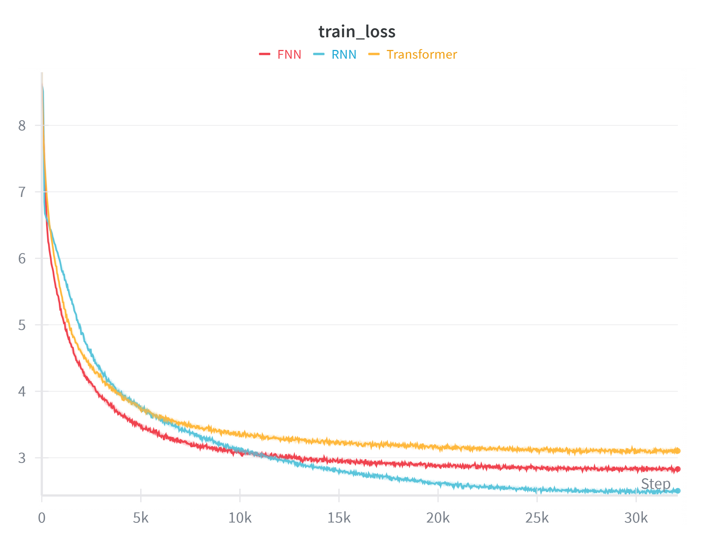
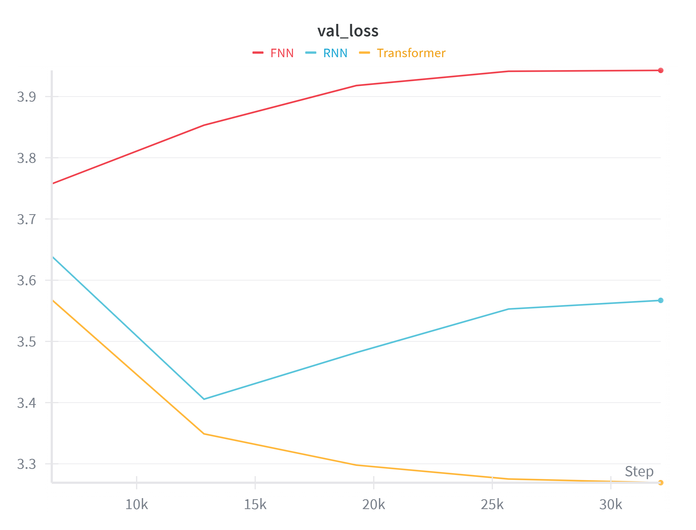

# 自然语言处理作业二——语言模型困惑度比较
## 困惑度（Perplexity, PPL）

困惑度（PPL）是衡量概率模型预测样本好坏程度的指标。对于一个语言模型，困惑度越低，表示模型对下一个词的预测越准确（即模型越不“困惑”）。
数学上，对于一个长度为 $N$ 的测试序列 $W = \{w_1, w_2, \dots, w_N\}$，语言模型 $P$ 在句子 $W$ 上的困惑度定义为：
$$
\begin{aligned}
PPL(W) &= P(w_1, w_2, \dots, w_N)^{-\frac{1}{N}}\\
&=(\prod_{i=1}^NP(w_i\mid w_{i-1},w_{i-2},\dots,w_1))^{-\frac{1}{N}}
\end{aligned}
$$
同时，语言模型 $P$ 的可用词表大小为 $V$，在句子 $W$ 上的交叉熵损失（Cross Entropy Loss）为：
$$
\begin{aligned}
CrossEntropyLoss(W)&=-\frac{1}{N}\sum_{i=1}^N(\sum_{k=1}^V q_k(i)\log (p_k(i)))\\
&=-\frac{1}{N}\sum_{i=1}^N\log(P(w_i))\\
&=-\frac{1}{N}\log(\prod_{i=1}^NP(w_i))\\
&=\log(\prod_{i=1}^{N}P(w_i))^{-\frac{1}{N}}
\end{aligned}
$$
其中，$q_k(i)$ 表示句子 $W$ 在位置 $i$ 在单词 $k$ 上的真实概率。由于 $W$  给定，因此这个概率在 $k=w_i$  取 1，否则取 0。$p_k(i)$ 表示语言模型 $P$ 在位置 $i$ 在单词 $k$ 上的预测概率。考虑 $W$ 给定，因此 $\sum_{k=1}^V q_k(i)\log (p_k(i))=\log(P(w_i))$
在实际计算中，为了避免数值溢出，我们通常使用交叉熵损失的指数形式来计算：
$$
PPL = \exp(\text{CrossEntropyLoss})
$$
其中，CrossEntropyLoss 是以自然对数 $e$ 为底计算的平均负对数似然。


## 前馈神经网络语言模型（FNN_LM）

前馈神经网络语言模型（FNN_LM）基于**多层感知机（MLP）**，将固定长度的上下文词（通常通过 one-hot 或词嵌入表示）拼接后输入全连接网络，输出下一个词的概率分布。其特点是只能处理固定长度的上下文，无法有效建模长距离依赖；训练和推理相对简单，但表达能力有限。
本代码使用的 FNN_LM 略有不同，没有直接采取拼接词向量的操作，而是用一个 `Conv1d` 来模拟**“N-gram”**，同时又具备全连接的**“平移不变性”**。同时，在 `Conv1d` 中采取 padding 操作来实现因果性。

```python
class FNN_LM(nn.Module):
    def __init__(self, vocab_size, embed_dim, hidden_dim, seq_len, window_size=5):
        super().__init__()
        self.seq_len = seq_len
        self.window_size = window_size 
        self.vocab_size = vocab_size
        self.embedding = nn.Embedding(vocab_size, embed_dim)
        self.pad_size = window_size - 1
        self.conv1 = nn.Conv1d(
            in_channels=embed_dim, 
            out_channels=hidden_dim, 
            kernel_size=window_size,
            padding=self.pad_size
        )
        self.relu = nn.ReLU()
        self.fc_out = nn.Conv1d(hidden_dim, vocab_size, kernel_size=1)

    def forward(self, x):     
        embeds = self.embedding(x).transpose(1, 2)
        h = self.conv1(embeds)
        h = self.relu(h)
        if self.pad_size > 0:
            h = h[:, :, :-self.pad_size]
        logits = self.fc_out(h)
        return logits.transpose(1, 2)
```


## 循环神经网络语言模型（RNN_LM）

循环神经网络语言模型使用 **RNN（如 LSTM、GRU）**对词序列进行逐词处理，隐藏状态可记忆历史信息，理论上能处理任意长度的上下文。其特点是能建模变长序列和一定程度的长距离依赖（尤其 LSTM/GRU 缓解了梯度消失问题）；但训练时存在顺序依赖，难以并行化，且对极长距离依赖仍有限制。

```python
class RNN_LM(nn.Module):
    def __init__(self, vocab_size, embed_dim, hidden_dim):
        super().__init__()
        self.embedding = nn.Embedding(vocab_size, embed_dim)
        self.lstm = nn.LSTM(embed_dim, hidden_dim, batch_first=True)
        self.fc = nn.Linear(hidden_dim, vocab_size)

    def forward(self, x):
        embeds = self.embedding(x)
        output, _ = self.lstm(embeds)
        logits = self.fc(output)
        return logits
```


## 自注意力机制网络语言模型（Transformer_LM）

自注意力机制神经网络语言模型基于 **Transformer** 架构，利用自注意力机制计算序列中任意两个词之间的相关性，无需依赖序列顺序。其特点是支持高度并行化训练，能直接建模任意距离的依赖关系；通过多头注意力捕捉不同子空间的语义关系。
标准的 **Transformer** 架构有 **Encoder** 和 **Decoder** 两个部分，**Encoder** 利用**双向注意力**，**Decoder** 利用**自注意力+交叉注意力**。对于本次作业，我们不需要 **Encoder** 和 **交叉注意力**，即需要构建的是一个 **Decoder-only** 架构，因此使用 Pytorch 的 `TransformerEncoder`，由一个自注意力层和一个前馈层组成，我们只需要在自注意力层上加一个 **Mask** 就实现和 **GPT** 一样的架构。

```python
class Transformer_LM(nn.Module):
    def __init__(self, vocab_size, embed_dim, hidden_dim, num_heads, layers, dropout):
        super().__init__()
        self.embedding = nn.Embedding(vocab_size, embed_dim)
        self.pos_encoder = nn.Parameter(torch.randn(1, 500, embed_dim))
        encoder_layer = nn.TransformerEncoderLayer(
            d_model=embed_dim,
            nhead=num_heads,
            dim_feedforward=hidden_dim,
            dropout=dropout,
            batch_first=True,
        )
        self.transformer_encoder = nn.TransformerEncoder(encoder_layer, num_layers=layers)
        self.fc = nn.Linear(embed_dim, vocab_size)
        self.embed_dim = embed_dim
    
    def forward(self, x):
        seq_len = x.size(1)
        embeds = self.embedding(x) * math.sqrt(self.embed_dim)
        embeds = embeds + self.pos_encoder[:,:seq_len,:]
        mask = nn.Transformer.generate_square_subsequent_mask(seq_len).to(x.device)
        output = self.transformer_encoder(embeds, mask=mask, is_causal=True)
        logits = self.fc(output)
        return logits
```


## 分词

对于本次作业 18MB 的中文文本数据和 5000+ 的词表大小，没有引入 HuggingFace Tokenizer，因为这些预训练好的 Tokenizer 中大部分是英文单词，而且汉字在 UTF-8 下会被切分成 3 个 token，使得词表稀疏和序列变长。因此对于本次作业，采取的是字级别的处理方式，将文本拆分成单个汉字，统计频率构建词表。
```python
class RealTextDataset(Dataset):
    def __init__(self, file_path, vocab=None, seq_len=20, is_train=True):
        self.seq_len = seq_len
        with open(file_path, 'r', encoding='utf-8') as f:
            text = f.read().replace('\n', '')
        self.data_chars = list(text)
        total_chars = len(self.data_chars)
        print(f"Loaded {file_path}: {total_chars} characters.")
        if vocab is not None:
            print("Using provided vocabulary.")
            self.token2idx = vocab
        elif is_train:
            print("Building vocabulary from scratch...")
            vocab_counter = Counter(self.data_chars)
            vocab_list = sorted(vocab_counter, key=vocab_counter.get, reverse=True)
            self.token2idx = {char: idx+1 for idx, char in enumerate(vocab_list)}
            self.token2idx['<unk>'] = 0
        else:
            raise ValueError("Validation set must use training vocab (vocab cannot be None)!")
        self.idx2token = {idx: char for char, idx in self.token2idx.items()}
        self.vocab_size = len(self.token2idx)
        self.data_ids = [self.token2idx.get(char, self.token2idx['<unk>']) for char in self.data_chars]
        self.data_ids = torch.tensor(self.data_ids, dtype=torch.long)

    def __len__(self):
        return len(self.data_ids) - self.seq_len

    def __getitem__(self, idx):
        src = self.data_ids[idx : idx + self.seq_len]
        trg = self.data_ids[idx + 1 : idx + self.seq_len + 1]
        return src, trg
```


## 训练

本次作业采取多卡并行和混合精度训练提高训练速度，训练损失为交叉熵损失，优化器为  `AdamW`，学习率调度器为  `OneCycleLR`，同时在训练过程中采取梯度裁剪（初次训练未采取梯度裁剪导致训练不收敛）。
使用 `wandb` 记录 train_loss 和 val_loss，如下图：
 


从 train_loss 来看，三个网络均以收敛，但是从 val_loss 来看，FNN 和 RNN 都出现过拟合，究其原因是模型架构本身的特性。FNN 通过 `Conv1d` 只能看到非常局部的上下文，无法捕捉长距离的语法或语义依赖。RNN相比于 FNN 能处理更长的序列，但是在 12k step 以后，RNN 达到了性能瓶颈，出现过拟合。Transformer 的自注意力机制能够使它关注序列中任何位置的词，真正理解句子的结构和语义，通过堆叠参数和训练轮数，Transformer 的性能会有进一步的提升。